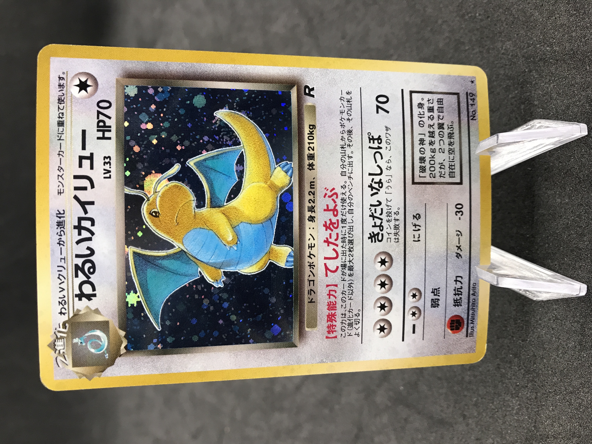
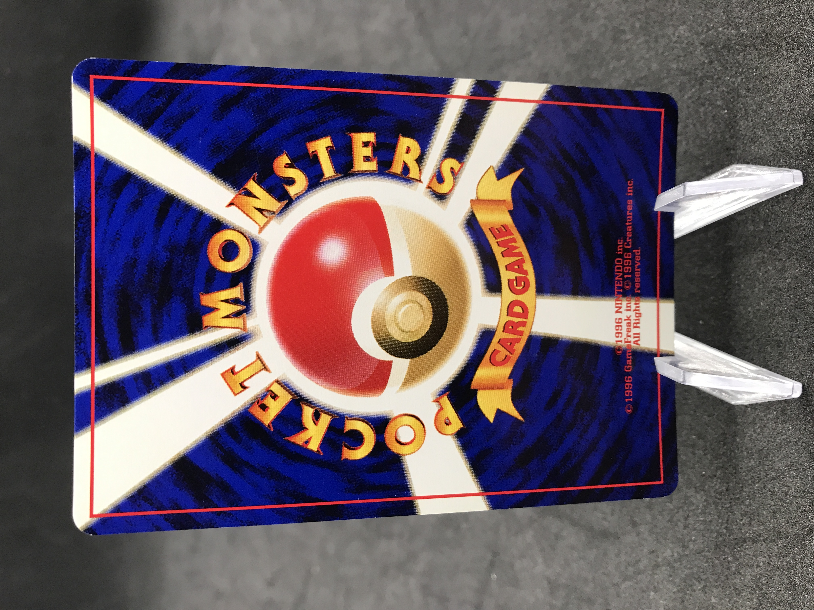
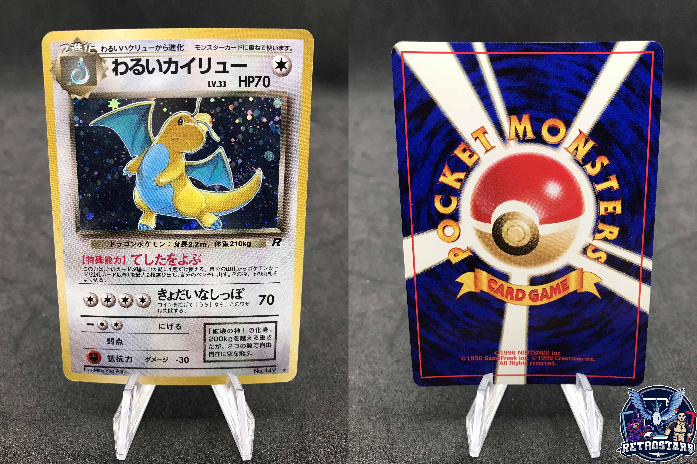

# Cardmarket Pictures Combiner

This program goal is to combine two pictures into one and potentially add a logo on the picture if you want it.
It was created to face one of the main limitation of cardmarket, the number of picture. If you sell items on cardmarket you've probably noticed that you can only upload one picture for a card, which is usually not enough for any buyer. You can combine two pictures to show the front and the back but it is a very time consuming process.
This program allow you to give as many item pictures as you want and combine them two by two.

## Installation for Linux Debian based distribution

Clone the repo and cd into into it:
```python
git clone https://github.com/nbrette/cardmarket_pictures_combiner
cd cardmarket_pictures_combiner
```

Install required packages:
 ```bash
 python3 install -r requirements.txt
 ```

 You're now ready to go !

 ## How it works

 Let's say you got the following directory containing your pictures. It is a classic example because  phones usually name the pictures with incremental numbers.

 ```bash
 .
├── IMG_8162.jpg
├── IMG_8163.jpg
├── IMG_8164.jpg
├── IMG_8167.jpg
└── logo.png
 ```

In that case the pictures `IMG_8162.jpg` and `IMG_8164.jpg` are front of cards and `IMG_8163.jpg` and `IMG_8167.jpg` are the back of the cards. The file `logo.png` is the logo you want to be pasted on the final picture (if you have one, it's not mandatory)

The pictures will be taken two by two and combined into one with the logo on the bottom right corner.

### Requirements

The directory containing your pictures must include your logo if you have one. If you have a logo the number of pictures in the folder should be odd otherwise it should be even.
The pictures to combine must follow each other ! Wich means the back of the card should be have the next number of the front if you order your pictures by name.

### Example






## How to use

The following command line arguments can be used to run the script

| Argument | Description   | Required    |
| :---:   | :---: | :---: |
| --folder_path | The path to the folder containing your pictures   | YES   |
| --logo_name | The name of your logo file (not the full path)  | NO   |
| --logo_height | The height of your logo once it's gonna be pasted on the final picture   | NO   |
| --logo_width | The widths of your logo once it's gonna be pasted on the final picture   | NO   |

The arguments related to the logo (logo_name, logo_width and logo_height) must be used all together, if one of these is missing it will raise an error.

To run the script without a logo:
```bash
python3 main.py --folder_path=./img
```

To run the script with a logo:
```bash
python3 main.py --folder_path=./img --logo_name=logo.png --logo_height=700 --logo_width=700
```

The combined pictures will be in a directory called `output`.

## Retrostars contact and shops


If you have not guessed it yet I am a professional card retailler as well as an engineer, you can find my shop Retrostars on multiple marketplaces:  
<a href="https://www.ebay.fr/str/retrostarsfr"> </a>
<a href="https://www.vinted.fr/member/38749036-retrostarsfr"></a>


In case you are a TCG seller and need a program to automate any of your task fell free to contact me at retrogamingstars@gmail.com


